# 차량 흐름과 도로이용 현황 및 휴게소 정보 제공 HI-REST

---

## 팀 구성

<table align="center">
  <tr>
    <td align="center" width="190px"></td>
    <td align="center" width="190px"></td>
    <td align="center" width="190px"></td>
    <td align="center" width="190px"></td>
  </tr>
  <tr>
    <td align="center"><b>윤대성</b></td>
    <td align="center"><b>윤승혁</b></td>
    <td align="center"><b>최지용</b></td>
    <td align="center"><b>한예나</b></td>
  </tr>
  <tr>
    <td align="center"><a href="https://github.com/YoonDaesung-01"></a></td>
    <td align="center"><a href="https://github.com/idenist"></a></td>
    <td align="center"><a href="https://github.com/antisdream"></a></td>
    <td align="center"><a href="https://github.com/hanyena0830"></a></td>
  </tr>
</table>
                                

---
## 실행 환경 (Environment)
> [requirements.txt](./requirements.txt)를 참조
---
## 🛠 1. 환경 변수 설정 및 실행 방법

이 프로젝트를 로컬 환경에서 실행하기 위해서는 `.env` 파일을 생성하고 아래의 변수들을 설정해야 합니다.

### 1. `.env` 파일 생성
프로젝트 루트 디렉토리에 `.env` 파일을 만들고 아래 내용을 복사하여 붙여넣으세요.

```env
# Database Connection
DB_HOST=localhost
DB_PORT=3306
DB_USER=root
DB_PASSWORD=""

# Database Names
DB_NAME_CARMASTER=carmaster_db
DB_NAME_VEHICLE_YEAR=vehicle_db_year
DB_NAME_FAQ=faq_data
DB_NAME_TRAFFIC=traffic
DB_NAME_REST=rest_area

# API Keys
ITS_API_KEY=""
```
### 2. Streamlit 애플리케이션 실행

`.env` 파일 설정이 완료되었다면, 프로젝트 루트 디렉토리(최상단) 폴더에서 터미널을 열고 아래 명령어를 입력하여 실행합니다.

```bash
# 의존성 라이브러리가 설치되어 있지 않다면 먼저 실행 (선택 사항)
# pip install -r requirements.txt

# Streamlit 앱 실행
streamlit run app.py
```
---

## 🖼 메인 페이지 및 기능 소개 (Features)
### 메인 페이지 및 사이드바
프로젝트의 전반적인 개요와 네비게이션을 제공합니다.

| 메인 대시보드 | 사이드바 메뉴 |
| :---: | :---: |
|  | 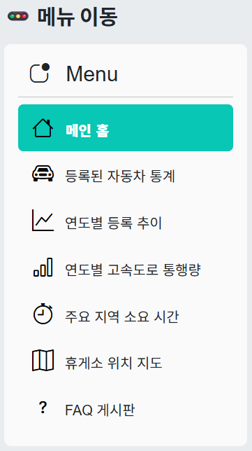 |
| **대시보드 안내**<br>부트캠프 기수, 조 이름, 슬로건 및 이용 안내 | **사이드바**<br>전체 메뉴 이동 및 기능 제어 |

#### 📂 사이드바 상세 메뉴
사용자는 사이드바를 통해 아래의 데이터 분석 페이지로 이동할 수 있습니다.
* **🏠 메인 홈**: 프로젝트 소개 및 팀 정보
* **📊 등록된 자동차 통계**: 차종별/지역별 등록 현황
* **📈 연도별 등록 추이**: 시간에 따른 자동차 등록 변화
* **🛣 연도별 고속도로 통행량**: 교통량 데이터 시각화
* **⏱ 주요 지역 소요 시간**: 출발/도착지별 실시간 예상 시간
* **📍 휴게소 위치 지도**: 고속도로별 휴게소 위치 정보
* **❓ FAQ 게시판**: 자주 묻는 질문 및 안내

---

### 📊 1) 등록된 자동차 통계
**최근 5개월간의 자동차 신규 등록 현황**을 다양한 기준으로 분석하여 시각화합니다.

#### ① 분석 기준 선택
드롭다운 메뉴를 통해 분석하고 싶은 기준(연료별, 차종별, 성별 등)을 확인하고 선택합니다.
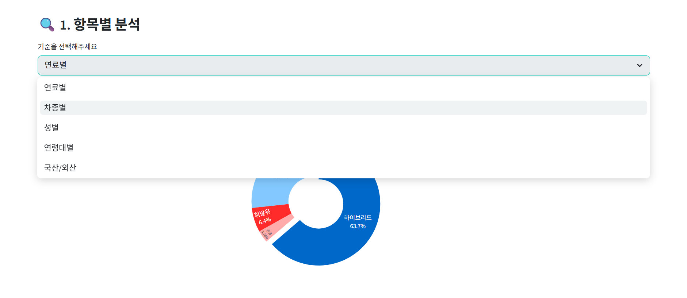

#### ② 항목 확정 및 필터링
원하는 항목이 선택되면 대시보드가 해당 데이터를 불러올 준비를 합니다.
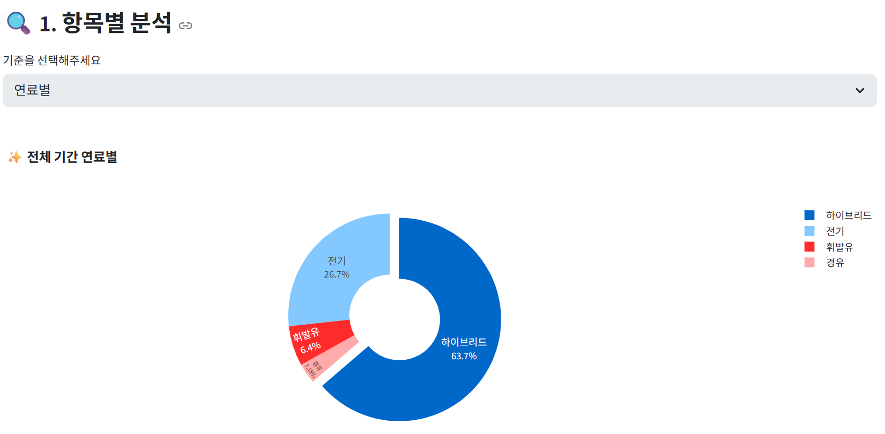

#### ③ 결과 시각화
선택한 기준에 따라 막대그래프나 파이차트로 통계 데이터가 즉시 표시됩니다.
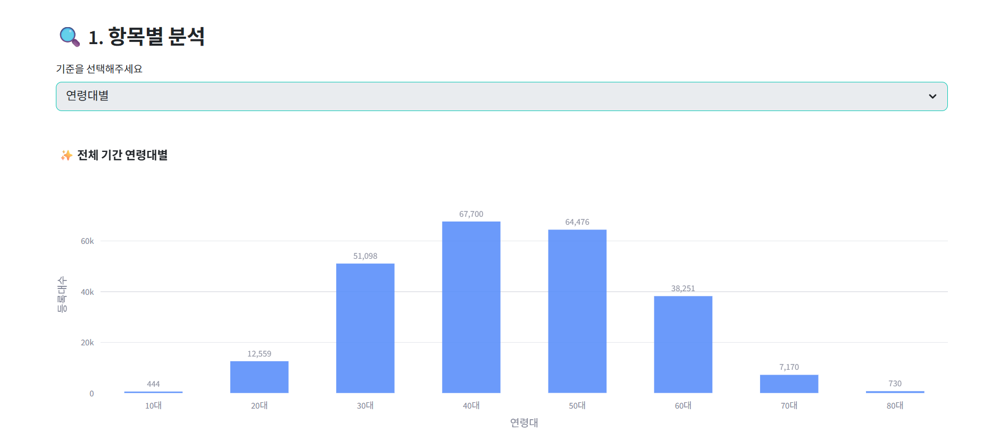

* **최근 5개월간의 추이**를 통해 최근 등록 트렌드를 파악할 수 있습니다.
* **인터랙티브 차트:** 차트의 각 항목을 클릭하여 구체적인 수치를 확인하거나, 세부 조건을 필터링할 수 있습니다.
---

### 📈 2) 연도별 자동차 등록 추이
**2017년부터 2025년까지의 자동차 등록 데이터**를 통해 누적되는 자동차 통계를 확인할 수 있습니다.

#### ① 연도별 자동차 등록 (전체 추이)
전체 누적 등록 대수의 변화를 꺾은선 그래프로 확인하며, 필요에 따라 차종별 누적 막대 그래프 모드로 전환이 가능합니다.
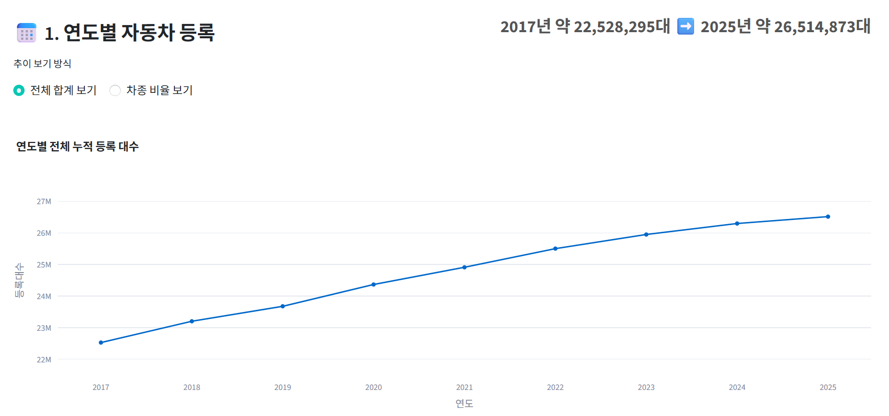

#### ② 연도별 상세 분석 (비중 확인)
특정 연도를 선택하여 해당 연도의 **차종별** 비중과 **용도별(자가용/영업용/관용)** 비중을 파이 차트로 비교할 수 있습니다.
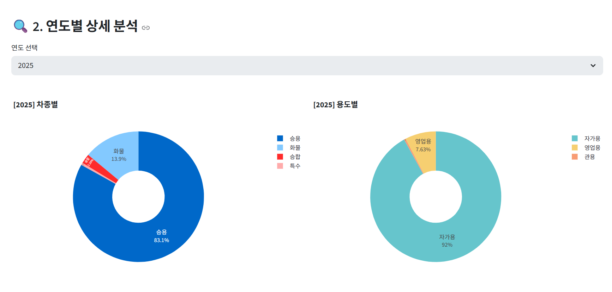

---

### 🛣 3) 연도별 고속도로 통행량
**2017년부터 2024년까지의 고속도로 교통량 변화**를 꺾은선 그래프로 시각화하여 교통량을 파악합니다.

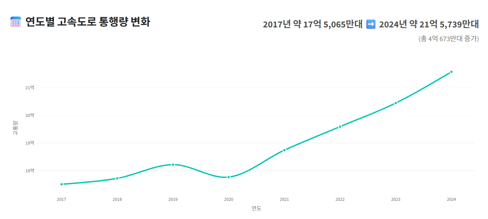

---

### ⏱ 4) 주요 지역 소요시간 (실시간 교통 정보)
전국 주요 도시 간의 **예상 소요시간**과 정체가 잦은 **주요 분기점의 실시간 CCTV**를 함께 제공합니다.

#### ① 노선별 소요시간 조회
서울 출발/도착 노선 및 주요 거점 간의 실시간 소요시간을 한눈에 파악할 수 있습니다.
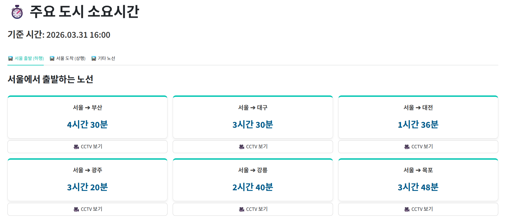

#### ② 실시간 CCTV 확인 (분기점 모니터링)
단순한 수치 정보뿐만 아니라, 각 노선에서 **가장 정체가 심한 주요 분기점(JC) 및 나들목(IC)**의 실시간 CCTV 화면을 바로 확인할 수 있습니다.
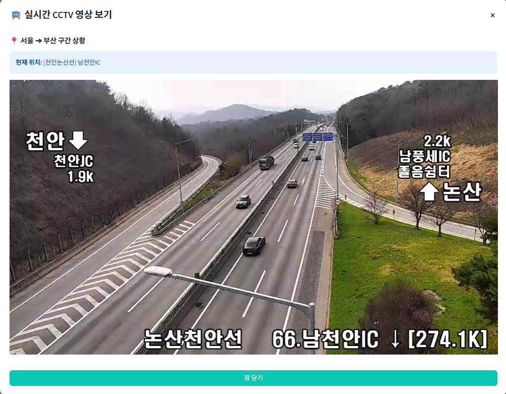

* **핵심 기능:**
    * **맞춤형 노선:** 서울 상/하행 대표 노선 및 전국 기타 주요 노선 지원
    * **병목 구간 모니터링:** 교통량이 많은 분기점 상황을 시각적으로 확인하여 우회 도로 판단 가능
    * **실시간 데이터:** 실시간 교통 정보를 기반으로 한 정확한 예상 도착 시간 제공

---

### 📍 5) 휴게소 위치 지도 및 상세 정보
전국 고속도로 **노선별 휴게소 위치**를 지도에서 확인하고, 주유소 가격부터 대표 메뉴까지 상세한 정보를 제공합니다.

#### ① 노선별 휴게소 탐색
지도에서 노선을 선택하면 해당 노선에 위치한 휴게소들이 마커로 표시됩니다. 리스트나 지도에서 원하는 휴게소를 간편하게 선택할 수 있습니다.
| 노선별 지도 보기 | 휴게소 명단 리스트 |
| :---: | :---: |
| 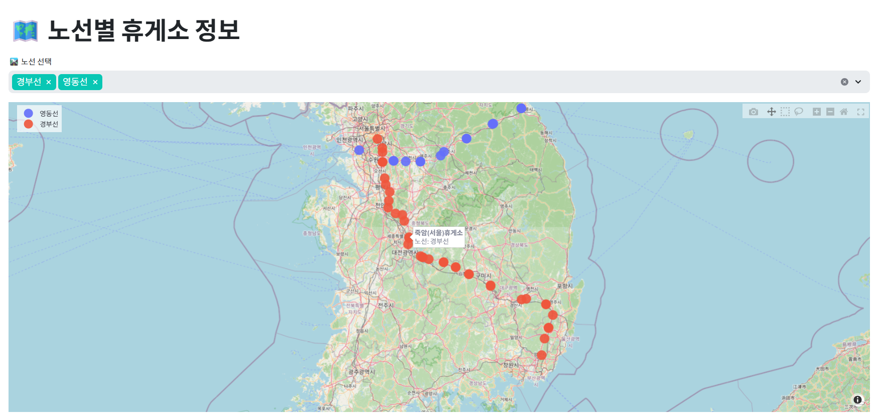 | 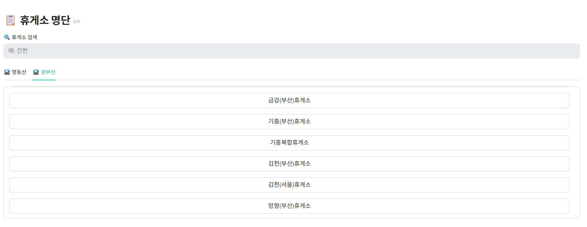 |

#### ② 휴게소 상세 정보 제공
선택한 휴게소의 **실시간 유가, 편의시설, 진행 중인 행사** 등 꼭 필요한 정보를 한눈에 보여줍니다.
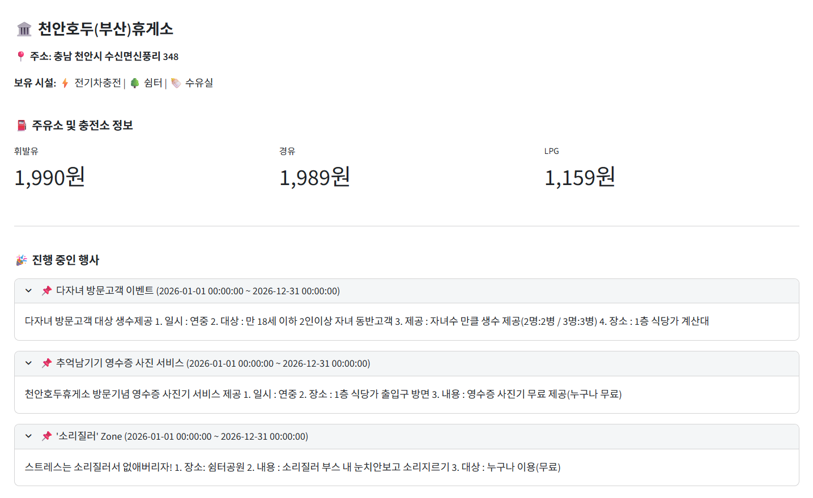

#### ③ 대표 메뉴 및 식당가 안내
휴게소별 베스트 메뉴와 전체 식당가 메뉴판, 가격 정보를 제공하여 방문 전 메뉴 선택을 돕습니다.
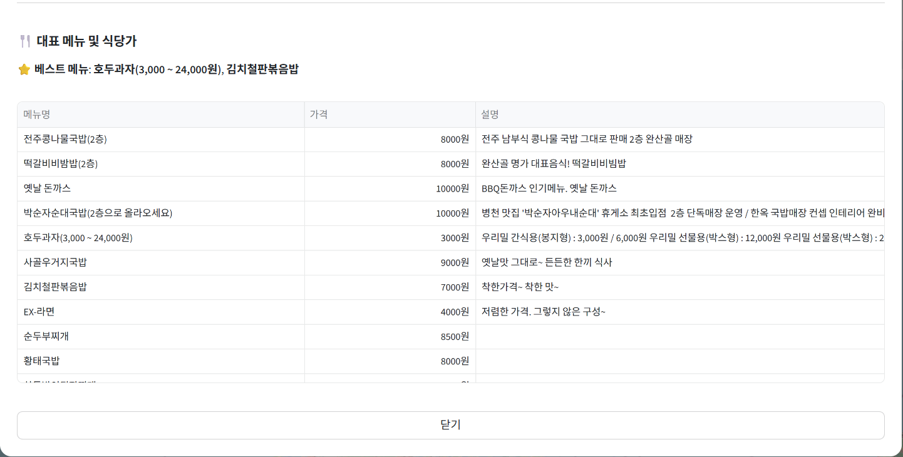

* **핵심 기능:**
    * **종합 편의 정보:** 전기차 충전소, 수유실, 쉼터 등 보유 시설 확인
    * **실시간 유가 정보:** 휘발유, 경유, LPG 가격 확인 가능
    * **이벤트 안내:** 휴게소별로 진행 중인 스탬프 투어나 할인 행사 정보 제공

---

### ❓ 6) 통합 FAQ 게시판
현대자동차, 기아자동차, 하이패스 공식 홈페이지의 데이터를 크롤링하여 사용자가 자주 묻는 질문을 한곳에서 편리하게 검색하고 확인할 수 있습니다.

#### ① 현대자동차 (HYUNDAI FAQ)
블루링크, 차량 정비, 디지털 키 등 현대자동차 이용 시 발생하는 궁금증을 카테고리별로 제공합니다.
| 카테고리 선택 | 상세 답변 확인 |
| :---: | :---: |
| 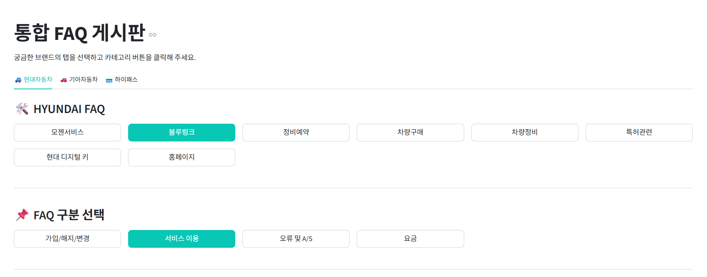 | 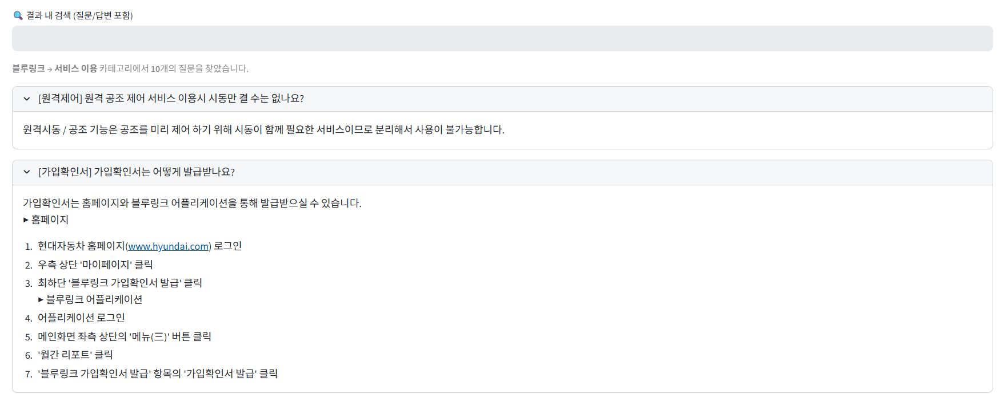 |

#### ② 기아자동차 (KIA FAQ)
기아멤버스, 차량 구매 및 정비 등 기아자동차 고객을 위한 주요 FAQ를 확인할 수 있으며, 지도 정보 오류 조치 방법 등 실질적인 가이드를 제공합니다.
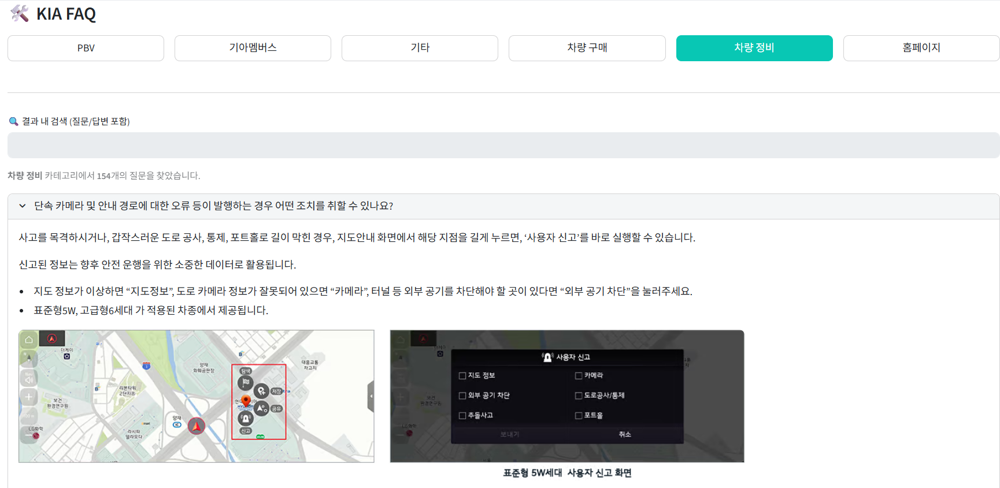

#### ③ 하이패스 (HIPASS FAQ)
단말기 등록, 선불카드 관리, 하이패스 서비스 이용 중 발생하는 오류 및 조치 방법을 상세히 안내합니다.
| 하이패스 카테고리 | 조치 방법 가이드 |
| :---: | :---: |
| 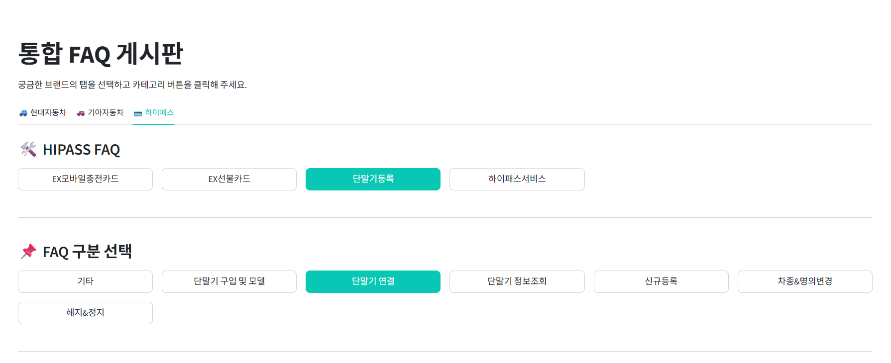 | 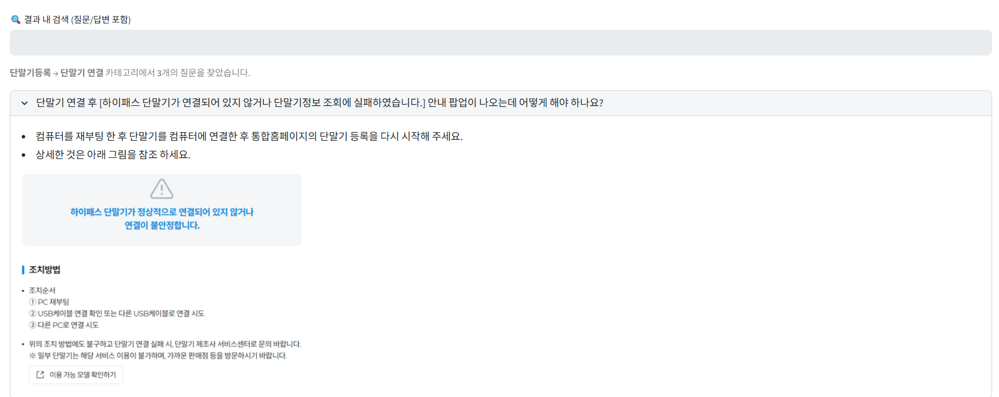 |

* **핵심 기능:**
    * **통합 검색:** 여러 브랜드에 흩어진 정보를 한곳에 모아 정보 접근성 향상
    * **카테고리 필터링:** 브랜드별 세부 카테고리(정비, 요금, 서비스 등)를 통한 빠른 문제 해결
    * **시각적 가이드:** 텍스트 설명뿐만 아니라 이미지 가이드도 포함하여 이해도 증진

---

## 📝 2. 프로젝트 배경 및 목적

해마다 누적 자동차 등록 대수와 고속도로 통행량이 증가함에 따라, 휴게소 이용량 또한 많아질 것으로 보입니다.<br>
그래서 저희는 운전자에게 필요한 고속도로 이용 정보 및 휴게소 상세 정보를 통합하여 제공하고자 합니다.<br>
휴게소 콘텐츠, 실시간 도로 상황, 각종 통계 등을 확인할 수 있는 페이지를 제작했습니다.

---

## 🛠 3. 핵심 기능

| 구분 | 기능 | 설명 |
| :--- | :--- | :--- |
| **데이터 수집** | **동적 크롤링** | 주요 노선 분기점 **실시간 CCTV** 영상 및 휴게소에 위치한 **주유소 연료값** 데이터 연동 |
| **시각화** | **지도 기반 정보 제공** | 전국 고속도로 노선별 휴게소 위치와 각 휴게소별 **편의시설, 메뉴, 행사** 정보 시각화 |
| **통계** | **차량 등록 현황 분석** | 연도별 자동차 등록 대수 통계를 **연료·차종·연령·성별** 등 항목별로 확인 |
| **정보 통합** | **통합 FAQ 게시판** | **현대·기아자동차 및 하이패스**의 고객 지원 데이터를 수집하여 통합 검색 지원 |

---
## 📁 4. GitHub 폴더 구조
```bash
PROJECT_1/

├── Crawling/                  # 크롤링 및 데이터 수집 관련 폴더
│   ├── dynamic_crw.ipynb      # FAQ 데이터 크롤링 
│   ├── rest_area2.ipynb       # 휴게소 데이터 정보 수집
│   ├── rest_event.ipynb       # 휴게소 이벤트 데이터 수집
│   ├── rest_gas.ipynb         # 휴게소 주유소 데이터 수집
│   ├── traffic_forecast.ipynb # 교통 예상 시간 데이터 수집
│   └── traffic_upload.py      # 교통 데이터 업로드 스크립트
├── page/                      # Streamlit 각 페이지 모듈 폴더
│   ├── page_faq.py            # FAQ 페이지
│   ├── page_map.py            # 휴게소 위치 지도 페이지
│   ├── page_stats.py          # 자동차 및 통계 페이지
│   ├── page_traffic_time.py   # 주요 지역 소요 시간 페이지
│   └── page_traffic.py        # 고속도로 통행량 페이지
├── picture/                   # 이미지 리소스 폴더
│   ├── ERD.png                # 데이터베이스 설계도
│   ├── highway.png            # 고속도로 배경 이미지
│   ├── readme main background.png # README용 배경 이미지
│   └── (기타 이미지 파일들...)
├── .env                       # 환경 변수 설정 파일 (API 키 등)
├── .gitignore                 # Git 제외 대상 설정 파일
├── app.py                     # Streamlit 메인 실행 파일
├── requirements.txt           # 설치 필요한 라이브러리 목록
├── sidebar.py                 # 사이드바 메뉴 구성 모듈
└── utils.py                   # 공통 유틸리티 함수 모듈
```
## 🏗 5. 시스템 아키텍처 및 데이터베이스 설계
본 프로젝트는 고속도로 휴게소 정보, 차량 통계, 교통량 및 FAQ 데이터를 체계적으로 관리하기 위해 관계형 데이터베이스(MySQL)를 사용하며, 실시간성이 중요한 데이터와 통계 데이터를 분리하여 설계했습니다.
### 5.1 시스템 아키텍처 및 데이터 흐름
데이터의 성격에 따라 **데이터베이스 저장(MySQL) 저장 방식**과 **Direct API 호출 방식**을 구분하여 효율성을 확보했습니다.
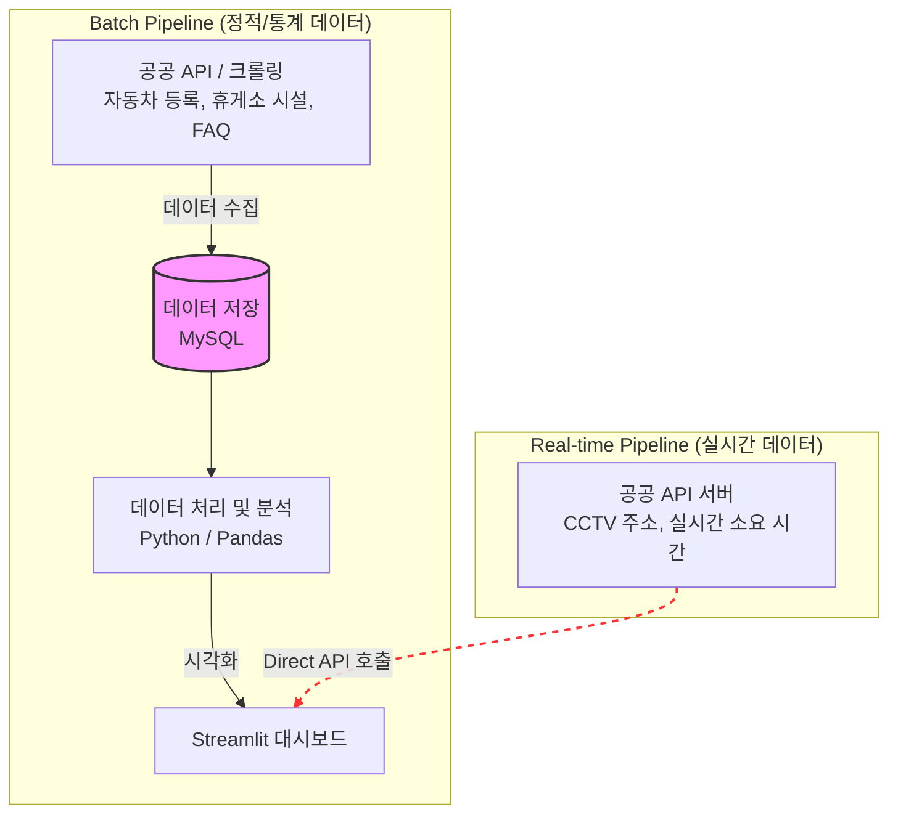
### 5.2 단계별 상세 기술
| 단계 | 기술 스택 | 주요 역할 |
| :--- | :--- | :--- |
| **Data Collection** | `Selenium`, `BeautifulSoup` | 공공 API 연동 및 브랜드별 FAQ/실시간 도로 정보 크롤링 및 .csv 파일 수집 |
| **Database** | `MySQL` | 수집된 자동차 등록 통계, 휴게소 시설 및 FAQ 데이터 관리 |
| **Data Processing** | `Python`, `Pandas` | 수집 데이터 정제 및 항목별 통계 분석 |
| **Visualization** | `Streamlit`, `Plotly` | 지도 기반 탐색 및 인터랙티브 그래프 구현 |
---
### 5.3 개념 모델 설계

#### 5.3.1 요구 정의서 (Requirements)
* **목적:** 고속도로 휴게소 정보, 자동차 등록 통계, 고속도로 통행량, 브랜드별 FAQ 통합 제공
* **주요 기능:** 지도 기반 휴게소 탐색, 실시간 유가 및 편의시설 조회, 연도별 차량/교통 통계 시각화, 브랜드 통합 FAQ
* **데이터 출처:** 공공 API(도로공사, ITS), 공공데이터포털 CSV, 웹 크롤링(현대/기아/하이패스)

#### 5.3.2 개념 엔티티 정의 (Based on ERD)
* **rest_areas:** 프로젝트의 중심이 되는 휴게소 기본 정보 (좌표, 노선명 등)
* **rest_area_sub:** 휴게소와 연관된 상세 정보 (음식, 편의시설, 주유소, 이벤트)
* **stats_data:** 독립적으로 관리되는 자동차 등록 및 고속도로 통행량 통계 데이터
* **faq_data:** 브랜드별(현대, 기아, 하이패스) 독립 FAQ 데이터

#### 5.3.3 개념 관계 (Conceptual Relationships)
데이터베이스 설계의 핵심은 **`rest_areas` (휴게소 기본 정보)** 테이블을 중심으로 상세 정보들이 유기적으로 연결된 구조입니다.

* **Rest Area : Food Info (1 : N)**
    * 한 휴게소에는 여러 개의 음식 메뉴 정보가 존재합니다. (`restarea_name` 기준)
* **Rest Area : Amenities (1 : 1)**
    * 한 휴게소는 하나의 표준화된 편의시설 현황(수유실, 전기차 충전소 등 보유 여부)을 가집니다.
* **Rest Area : Gas Station (1 : 1)**
    * 한 휴게소는 하나의 주유소 정보(실시간 유가, 브랜드, 위치 등)와 매칭됩니다.
* **Rest Area : Events (1 : N)**
    * 한 휴게소에서는 기간별로 여러 개의 이벤트나 홍보 행사가 진행될 수 있습니다.
* **Independent Stats (독립 엔티티)**
    * `car_registration_stats`, `highway_traffic`, `vehicle_registrations` 등은 특정 휴게소에 종속되지 않고, **연도/지역/차종**을 기준으로 관리되는 독립적인 통계 데이터군입니다.

### 5.4 ERD (Entity Relationship Diagram)
전체 데이터 구조와 테이블 간의 관계(1:1, 1:N)는 아래와 같습니다.


---

### 5.5 물리 모델 설계 (DDL)

ERD 구조를 바탕으로 구현된 MySQL 전용 테이블 생성 스크립트입니다. 

#### ① 휴게소 통합 정보 (Rest Area Cluster)
휴게소 기본 정보를 부모로 하며, 음식·편의시설·주유소·이벤트 정보가 외래키(FK)로 연결됩니다.

```sql
-- 휴게소 기본 정보 (부모 테이블)
CREATE TABLE rest_areas (
    restarea_name VARCHAR(200) PRIMARY KEY,
    route_name VARCHAR(100),
    xValue DOUBLE,
    yValue DOUBLE,
    service_area_code VARCHAR(50)
) ENGINE=InnoDB DEFAULT CHARSET=utf8mb4;

-- 휴게소 음식 정보
CREATE TABLE foodinfo (
    restarea_name VARCHAR(200),
    foodNm VARCHAR(50),
    foodCost VARCHAR(20),
    etc TEXT,
    recommendyn VARCHAR(2),
    seasonMenu VARCHAR(2),
    bestfoodyn VARCHAR(2),
    premiumyn VARCHAR(2),
    FOREIGN KEY (restarea_name) REFERENCES rest_areas(restarea_name)
) ENGINE=InnoDB DEFAULT CHARSET=utf8mb4;

-- 휴게소 편의시설 정보
CREATE TABLE rest_area_amenties (
    restarea_name VARCHAR(200) PRIMARY KEY,
    rest_eng CHAR(1), rest_elc CHAR(1), rest_plc CHAR(1), rest_pha CHAR(1), rest_nur CHAR(1),
    FOREIGN KEY (restarea_name) REFERENCES rest_areas(restarea_name)
) ENGINE=InnoDB DEFAULT CHARSET=utf8mb4;

-- 휴게소 주유소 정보
CREATE TABLE rest_area_gas (
    restarea_name VARCHAR(200) PRIMARY KEY,
    route_name VARCHAR(100),
    lpgYn TINYINT,
    gasoline_price INT,
    disel_price INT,
    lpg_price INT,
    svarAddr VARCHAR(50),
    FOREIGN KEY (restarea_name) REFERENCES rest_areas(restarea_name)
) ENGINE=InnoDB DEFAULT CHARSET=utf8mb4;

-- 휴게소 이벤트 정보
CREATE TABLE rest_area_events (
    id BIGINT AUTO_INCREMENT PRIMARY KEY,
    std_rest_cd VARCHAR(50),
    start_time DATETIME,
    route_name VARCHAR(100),
    restarea_name VARCHAR(200),
    end_time DATETIME,
    event_detail TEXT,
    event_name TEXT,
    FOREIGN KEY (restarea_name) REFERENCES rest_areas(restarea_name)
) ENGINE=InnoDB DEFAULT CHARSET=utf8mb4;
```
#### ② 차량 등록 및 교통 통계 (Vehicle & Traffic Stats)
연도별/항목별 차량 등록 현황 및 고속도로 통행량 통계 데이터입니다.
```sql
-- 상세 차량 등록 통계
CREATE TABLE car_registration_stats (
    id INT AUTO_INCREMENT PRIMARY KEY,
    regist_yy VARCHAR(4), regist_mt VARCHAR(2), vhcty_asort_code VARCHAR(1),
    regist_grc_code VARCHAR(2), use_fuel_code VARCHAR(2), cnm_code VARCHAR(6),
    prpos_se_code VARCHAR(1), sexdstn VARCHAR(10), agrde VARCHAR(1),
    dspvl_code VARCHAR(2), hmmd_imp_se_nm VARCHAR(10), prye VARCHAR(4),
    cnt INT, created_at TIMESTAMP DEFAULT CURRENT_TIMESTAMP
) ENGINE=InnoDB DEFAULT CHARSET=utf8mb4;

-- 고속도로 통행량 및 등록 추이
CREATE TABLE highway_traffic (
    id INT AUTO_INCREMENT PRIMARY KEY,
    traffic_year INT, vehicle_class VARCHAR(20), traffic_volume BIGINT,
    created_at TIMESTAMP DEFAULT CURRENT_TIMESTAMP
) ENGINE=InnoDB DEFAULT CHARSET=utf8mb4;

CREATE TABLE vehicle_registrations (
    reg_year INT, vehicle_type VARCHAR(20),
    total_count INT, official_count INT, private_count INT, business_count INT,
    PRIMARY KEY (reg_year, vehicle_type)
) ENGINE=InnoDB DEFAULT CHARSET=utf8mb4;
```
#### ③ 통합 FAQ 및 예측 정보 (FAQ & Forecast)
브랜드별 FAQ 데이터와 교통 예측 정보를 관리합니다.
```sql
-- 브랜드별 FAQ (현대, 기아, 하이패스)
CREATE TABLE hyundai_faq (
    id INT AUTO_INCREMENT PRIMARY KEY,
    category_main VARCHAR(100), category_sub VARCHAR(100),
    question TEXT, answer TEXT, created_at TIMESTAMP DEFAULT CURRENT_TIMESTAMP
) ENGINE=InnoDB DEFAULT CHARSET=utf8mb4;

CREATE TABLE kia_faq (
    id INT AUTO_INCREMENT PRIMARY KEY,
    category VARCHAR(100), question TEXT, answer TEXT, created_at TIMESTAMP DEFAULT CURRENT_TIMESTAMP
) ENGINE=InnoDB DEFAULT CHARSET=utf8mb4;

CREATE TABLE hipass_faq (
    id INT AUTO_INCREMENT PRIMARY KEY,
    category_main VARCHAR(100), category_sub VARCHAR(100),
    question TEXT, answer TEXT, created_at TIMESTAMP DEFAULT CURRENT_TIMESTAMP
) ENGINE=InnoDB DEFAULT CHARSET=utf8mb4;

-- 교통 예측 정보
CREATE TABLE forecast_traffic (
    id INT AUTO_INCREMENT PRIMARY KEY,
    sdate VARCHAR(20),
    stime VARCHAR(20),
    cjunkook VARCHAR(200),
    cjibangDir VARCHAR(200),
    cseoulDir VARCHAR(200),
    -- ... (기타 도시 컬럼 생략 없이 ERD 기반 생성 가능)
    fetched_at TIMESTAMP DEFAULT CURRENT_TIMESTAMP
) ENGINE=InnoDB DEFAULT CHARSET=utf8mb4;
```
---

## 📚 6. 사용한 데이터 (Data Sources & Preprocessing)

프로젝트에 사용된 데이터는 공공기관 API, 국가 통계 포털, 그리고 각 브랜드사 FAQ를 기반으로 하며, 데이터베이스 내 테이블명과 매칭하여 정리했습니다.

### 6.1 데이터 출처 및 활용 현황

| 출처 | 데이터명 (Table Name) | 링크 |
| :--- | :--- | :--- |
| **국가데이터처** | 자동차등록대수현황 (`vehicle_registrations`) | [KOSIS 바로가기](https://kosis.kr/statHtml/statHtml.do?sso=ok&returnurl=https%3A%2F%2Fkosis.kr%3A443%2FstatHtml%2FstatHtml.do%3Fconn_path%3DI2%26tblId%3DDT_MLTM_1244%26orgId%3D116%26) |
| **국토교통부** | 자동차등록현황보고 (`car_registration_stats`) | [통계누리 바로가기](https://stat.molit.go.kr/portal/cate/statView.do?hRsId=58&hFormId=5498) |
| **공공데이터포털** | 휴게소 기본 정보 (`rest_areas`) | [데이터포털 바로가기](https://www.data.go.kr/data/15025446/standard.do) |
| **한국도로공사** | 노선별 휴게시설 현황 (`rest_area_amenties`) | [데이터플랫폼 바로가기](https://data.ex.co.kr/openapi/basicinfo/openApiInfoM?apiId=0317) |
| **한국도로공사** | 현재 교통예보 현황 (`forecast_traffic`) | [데이터플랫폼 바로가기](https://data.ex.co.kr/openapi/basicinfo/openApiInfoM?apiId=0303) |
| **한국도로공사** | 주유소별 가격 및 업체 현황 (`rest_area_gas`) | [데이터플랫폼 바로가기](https://data.ex.co.kr/openapi/basicinfo/openApiInfoM?apiId=0312) |
| **한국도로공사** | 휴게소 행사 현황 조회 (`rest_area_events`) | [데이터플랫폼 바로가기](https://data.ex.co.kr/openapi/basicinfo/openApiInfoM?apiId=0505) |
| **한국도로공사** | 휴게소 푸드메뉴 현황 조회 (`foodinfo`) | [데이터플랫폼 바로가기](https://data.ex.co.kr/openapi/basicinfo/openApiInfoM?apiId=0502) |
| **ITS 국가교통정보센터** | 실시간 CCTV 화상자료 | [ITS 바로가기](https://www.its.go.kr/opendata/opendataList?service=cctv) |
| **KIA** | 기아자동차 FAQ (`kia_faq`) | [공식 홈페이지](https://www.kia.com/kr/customer-service/center/faq) |
| **현대자동차** | 현대자동차 FAQ (`hyundai_faq`) | [공식 홈페이지](https://www.hyundai.com/kr/ko/faq.html) |
| **한국도로공사** | 하이패스 FAQ (`hipass_faq`) | [공식 홈페이지](https://hipass.co.kr/board/selectFaqList.do) |

---

### 6.2 데이터 전처리 (Data Preprocessing)

수집된 데이터의 효율적인 활용을 위해 다음과 같은 최소한의 최적화 전처리를 수행했습니다.

* **CSV 컬럼 최적화:** 국가 통계 및 공공데이터 CSV 파일 내의 컬럼 중, 대시보드 구현 및 분석에 필수적라고 생각하는 컬럼만을 선별하여 데이터를 재구성했습니다.
* **API 호출 매개변수 설정:** 각 기관에서 제공하는 OpenAPI 호출 시, 불필요한 데이터를 방지하기 위해 서비스에 필요한 특정 데이터(지역, 노선 등)만 정확히 수집하기 위해 매개변수(Parameter)를 정의하여 적용했습니다.

---

### 7. 팀원 회고

- **윤대성** : <br>
이번 프로젝트를 통해 OpenAPI 연동 및 Streamlit을 활용한 대시보드 구현 경험을 해볼 수 있었습니다. 특히 다양한 데이터를 활용하여 기능을 확장해나가는 과정도 좋았지만, 사용 목적에 맞게끔 데이터를 가공하는 전처리 과정이 중요하다는 점을 느꼈습니다. <br>협업 과정에서는 개별 로컬 DB 사용으로 인한 데이터 불일치 문제를 해결하기 위해, 공통 네트워크 상의 3306 포트를 개방하여 공유 서버로 활용했습니다. 이를 통해 팀원 모두가 실시간으로 동일한 데이터로 작업할 수 있는 환경을 구축하여 협업 효율을 올린 경험을 쌓았습니다. <br>하지만 아쉬웠던 점은 좋은 아이디어가 많이 나왔음에도 주어진 시간이 많지 않아 모든 기능을 구현하지 못한 부분입니다. 또한, 이번 분석이 기존의 당연한 결과를 재확인하는 분석이었다면, 다음에는 데이터를 가지고 새로운 인사이트를 도출하거나 다양한 분석 기법을 적용한 데이터 분석을 경험해보고자 합니다.

- **윤승혁** : <br>

- **최지용** : <br>

- **한예나** : <br>
